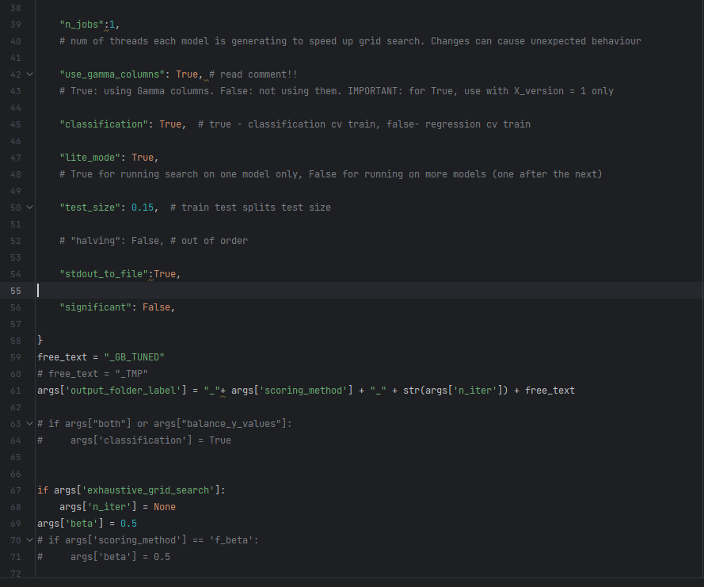
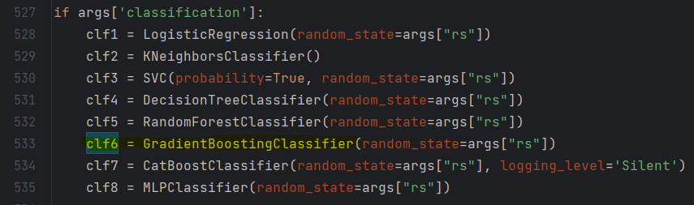
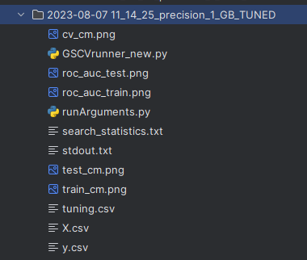

# Investigating Advanced ML Algorithms for Determining the Efficacy of TMS Treatment in MDD Patients

## Introduction

This project is a brief description of your project and its purpose. It was developed as part of 0368352201 - Workshop on Computational Methods in Brain Research with the invaluable support and guidance from the following individuals:

- Professor Nitsan Censor from Tel Aviv University.
- Gil Issaschar from Firefly-Neuroscience Company.
- PHD Offir Laufer from Firefly-Neuroscience Company.

## Background and Importance:

Major Depressive Disorder (MDD) is a complex and prevalent mental health condition affecting millions of individuals worldwide. While traditional treatments, such as antidepressant medications and psychotherapy, have been the primary approach to managing MDD, Transcranial Magnetic Stimulation (TMS) has emerged as a promising alternative therapy. TMS is a non-invasive procedure that uses magnetic fields to stimulate specific regions of the brain associated with mood regulation.

Despite the increasing adoption of TMS in clinical settings, there is still a need to determine its efficacy accurately, particularly for individual patients. The response to TMS treatment can vary significantly from patient to patient, and predicting the likelihood of a positive outcome is challenging. Traditional diagnostic methods rely on subjective assessments, which can lead to delays in identifying the most suitable treatment option and potentially ineffective interventions.

## Project Overview

The primary objective of this research project is to investigate the application of advanced Machine Learning (ML) algorithms for predicting the efficacy of TMS treatment in MDD patients. By leveraging  datasets containing demographic, clinical, and neuroimaging information, we aim to develop predictive models that can accurately assess the likelih

## Usage and Permissions

1. Any usage, reproduction, or distribution of the code in this repository that falls under the terms of the agreement between the involved parties (e.g., Firefly-Neuroscience, TAU, and myself Dan Evron) is permitted and regulated by the terms of that agreement.

2. For any usage not explicitly covered by the aforementioned agreement, you must seek comprehensive permission from me, Dan Evron, the project owner, before using any code or files from this repository.

3. Unauthorized usage or distribution of the code without my explicit permission or violating the agreed terms with other parties will be considered a violation of rights and subject to legal action if necessary.

## Getting Started
### Requirements
#### Option 1: Running locally
    1. python 3.8 and above 
    2. All installed libraries

#### Option 2: Running in cloud (google colab)
    1.Open your google drive and login to your account
https://drive.google.com

    2. click "New" -> "Folder upload"

    
    3. Select the project repostioty (upload may take a few minutes...)

    4.Open google colab: https://colab.research.google.com/?utm_source=scs-index
    5. Upload the notebook from the repository called "grid_search_runner.ipynb" to your  
    select "File"-> "Upload notebook"

    4. Uplolad th "grid_search_runner.ipynb" from this repository. It should look like that:

    
    5. Run first cell (press the play button)

    6. Run second cell

    7. Run third cell

    8. Follow all "Running Steps" below. Treat Elminda_BETA as the folder which has just opened at your left

## Demonstration of using the system

### Running steps:

###  1. Set your configuration parameters for the run in Elminda_BETA\second_research\runArguments.py
#### These parameters define the setup of your grid search run, and determine the conditions your search will run under. 
##### Example:

We have just defined in this example a GSCV run with next attributes:

* 10 iterations (n_iter) of search
* 5 folds (cv) per iteration
* Both datasets (both:True) to use all data from both research centers (Israel and USA) in our analysis
* precision (scoring_method) as out scorer for evaluating performance in cross validation 
* all possible features in our initial dataset (X_version: 1) for cross validation (further processing steps during cv such as dimension reduction may still appear)
* fixed random state for future replication of experiments (rs:42)
* all subjects at once in the input dataframe for grid search (split_row: normal)
* test size to be  15% of all data (test_size:0.15) 
* directing our standard output to a file (stdout_to_file:True) - the file will be part of the output folder of this running session. 
* I also added the option to tag output folder not just by timestamp, n_iter and soring_method (explained in next sections), but also adding free text as the suffix of folder name (free_text=_GB_TUNED). 
* All other parameters should not be changed, they are there for code-legacy but it's recommended to consider removing them in next version updates (changes are at your own risk!)

### 2.Select classifier and pipeline and 'tune' your hyper parameters
####  Go to second_research\GSCVrunner_new.py and under next two if statements set your wanted param_pipe_list of the grid and pipe you want to run grid with.

    if args['classification']:
        if args['lite_mode']:
            param_pipe_list = %PLACE HOLDER FOR YOUR INPUT%
###### Example:

You should also configure the grid of parameters properly, so it will match your needs (depends on search space you are interested at) and on pipeline.
###### Example:

In this example we have arbitrarily selected Classifier #6 which is GradientBoosting.   

### 3.
### If working locally -> run second_research\GSCVrunner_new.py

### If working from google-colab -> press run the last cell

#### Locally:

Right click and:

#### Colab:

#### This will trigger the cv grid search. The expected output is a directory with all relevant files and scores from cross validation.

### 4.Check out your output directory
#### At second_research directory you'll see a new directory with the label of current GSCV run with next format:
%Current timestamp(YYYY-MM-DD-HH-MM-SS)%\_%Scorer chosen for cross validation (passed in config file)%\_%Number of iterations in CV%\_%Free text (optional)%.

It contains graphs, results and important files describe your search train and prediction results.
##### Examples:

2023-08-07 11_14_25_precision_1_GB_TUNED

This directory contains artifacts produced during grid search run, such as: main python file (GSCVrunner_new.py) and config file (runArguments.py) used (for replication in case of need), graphs, output log if required in config (stdout.txt),data copies,  and other statistics. 

Plots:

Output log of cross-validation grid search process:

In the output log, 3 "reports" will be printed at the end each of following steps: 1. grid search 2. re-training and predicting on train set (just for the record) 3. prediction on unseen test set (this step was added to the code just recently, so we can perform a (single) test for each reported pipeline in paper).
The confusion matrix and ROC-AUC plots at the output folder are based on these reports, as well as the tuning.csv file in output dir which is based on the first report only. It saves results of cross validation.

First report - cv:

First report- exported to tuning.csv:

Second and third reports - train and test:

Older search results are available for your convenience in experiment_results_archive directory.

 

## Contact

evrondan99@gmail.com
 
